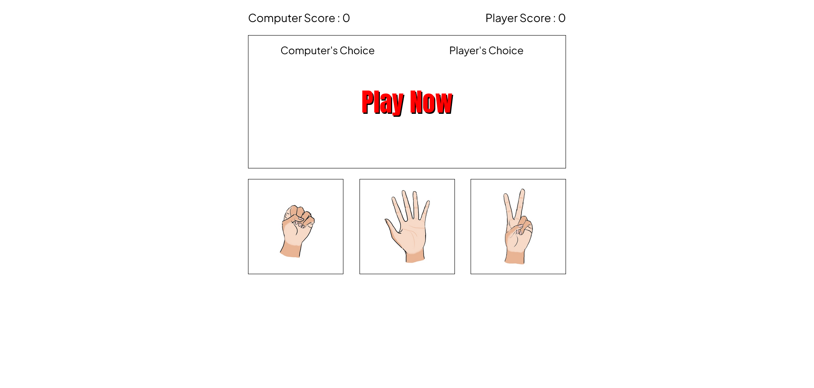

# Rock Paper Scissor Game
A javascript project based on traditional [rock paper scissor game](https://en.wikipedia.org/wiki/Rock_paper_scissors). This project is part of [Odin Project](https://www.theodinproject.com/lessons/foundations-rock-paper-scissors) Curriculum.

### How Does It Work?
Just like the original Rock-Paper-Scissor there are only three rules:

1. Rock beats Scissor.
2. Scissor beats Paper.
3. and Paper beats Rocks.

And that it. Thats how it works. Give it a try.

Live Preview : [website-link](https://akanksha493.github.io/Rock-Paper-Scissor-Game/)

Screenshot of website: 

### Useful Resources
1. For sound effects: [mixkit.co](https://mixkit.co/free-sound-effects/win/), [pixelbay](https://pixabay.com/sound-effects/search/buzzer/).
2. For font : [google fonts](https://fonts.google.com/).
3. Other resources :  stack-overflow, w3school, 
[article on fluid typography](https://web.dev/min-max-clamp/).